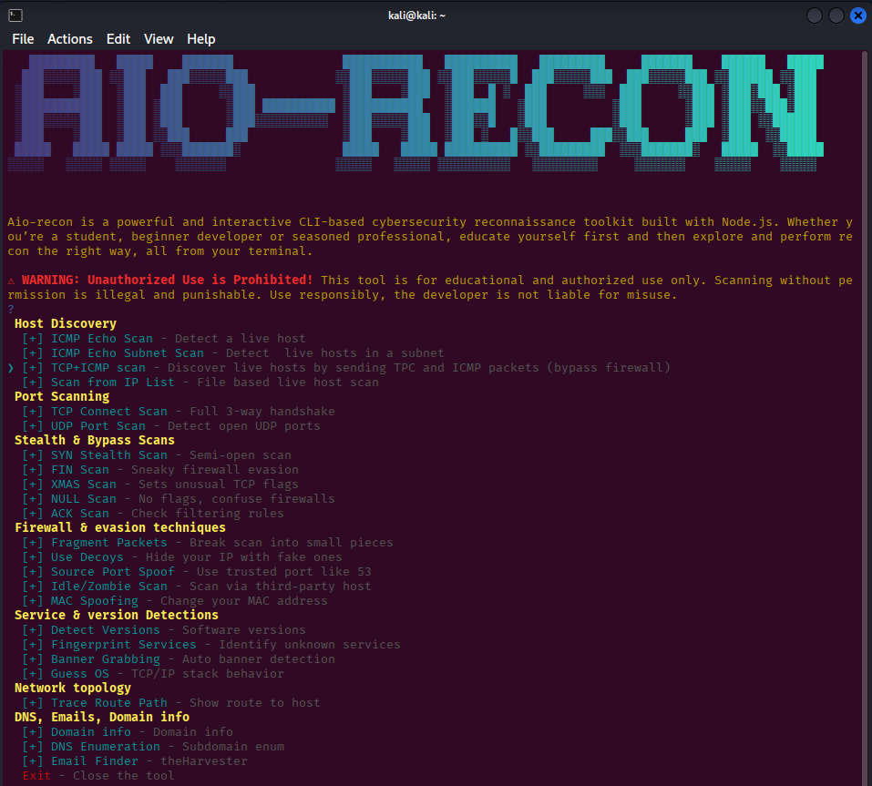

# AIO-Recon

AIO-Recon is an interactive CLI tool that simplifies and speeds up the information-gathering phase by combining multiple recon tools (like Nmap, Whois, TheHarvester, etc.) in one place. It offers guided prompts, educational insights, and one-click execution making it ideal for beginners, students, developers, and professionals. This project highlights the value of automation and tool integration in strengthening the recon phase of the Cyber Kill Chain.


## Author

- [@Anika Gupta](https://www.github.com/anikaguptas)


## Demo



## Deployment

To make AIO-Recon accessible globally from any terminal window:

```bash
npm i -g aio-recon
```

Then you can launch the tool from anywhere using:

```bash
sudo aio-recon
```

## Installation

You can install AIO-Recon directly using npm:


```bash
npm i aio-recon
sudo aio-recon
```
    
## Feedback

If you have any feedback, please reach out to us at anikaguptaindia@gmail.com


## Contributing

Contributions are always welcome!


##
